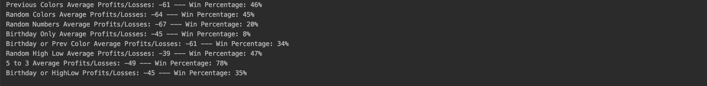

# Roulette Strategy Analyzer

### Summary
One day I was curious about how different strategies of Roulette would perform against eachother. So I created a quick program to compare how much money they would win/lose (almost always lose) and the win percentage of each strategy.

### Tools
Java

### Preview
Some of the outputs from the Program:

